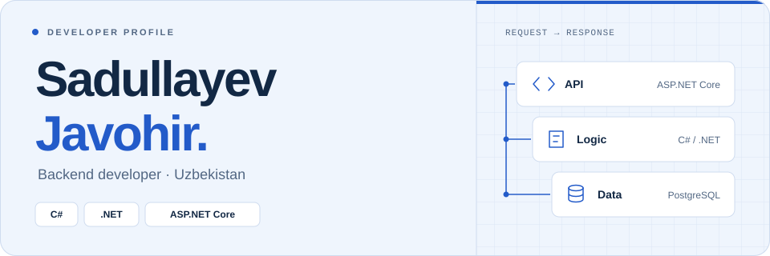

<!-- Upload README.md and the profile-assets folder together to the profile repository. -->

<picture>
  <source media="(prefers-color-scheme: dark)" srcset="./profile-assets/header-dark.svg">
  <source media="(prefers-color-scheme: light)" srcset="./profile-assets/header-light.svg">
  
</picture>

  <a href="#selected-work">Selected work</a>
  &nbsp;&nbsp; / &nbsp;&nbsp;
  <a href="#toolbox">Toolbox</a>
  &nbsp;&nbsp; / &nbsp;&nbsp;
  <a href="https://github.com/Sadullayev-Javohir?tab=repositories">All repositories</a>
  &nbsp;&nbsp; / &nbsp;&nbsp;
  <a href="mailto:javohirsadullayev2024@gmail.com">Get in touch</a>

---

### A little about me

I'm **Javohir**, a backend developer from **Uzbekistan**, focused on **C#, .NET, and ASP.NET Core**. This is where I share my projects, learning notes, and the problems I work through along the way.

- **Main focus** — backend development with the .NET ecosystem.
- **Currently learning** — data structures and algorithms.
- **My approach** — write it, understand it, make it better.

## Selected work

Full-stack .NET projects, backend learning, and problem-solving.

<table>
  <tr>
    <td width="50%" valign="top">
      
BACKEND · C# / ASP.NET CORE

      <h3><a href="https://github.com/Sadullayev-Javohir/ASPNET120">ASP.NET — 120 Days ↗</a></h3>
      
A structured ASP.NET Core learning journey, with a 120-day study plan.

      
<code>C#</code> <code>ASP.NET Core</code>

    </td>
    <td width="50%" valign="top">
      
BACKEND · .NET ECOSYSTEM

      <h3><a href="https://github.com/Sadullayev-Javohir/dotNetAspNet">.NET &amp; ASP.NET ↗</a></h3>
      
A 90-day learning plan exploring .NET and ASP.NET Core.

      
<code>C#</code> <code>.NET</code>

    </td>
  </tr>
  <tr>
    <td width="50%" valign="top">
      
FOUNDATIONS · PROBLEM-SOLVING

      <h3><a href="https://github.com/Sadullayev-Javohir/DSA">Data Structures &amp; Algorithms ↗</a></h3>
      
Algorithm practice and data structures, one problem at a time.

      
<code>C#</code> <code>Algorithms</code>

    </td>
    <td width="50%" valign="top">
      
EDTECH · AI-ASSISTED LEARNING

      <h3><a href="https://github.com/Sadullayev-Javohir/englishai">EnglishAI ↗</a></h3>
      
An English-learning platform combining an ASP.NET Core backend, a React client, and AI services.

      
<code>C#</code> <code>ASP.NET Core</code> <code>React</code>

    </td>
  </tr>
  <tr>
    <td width="50%" valign="top">
      
REAL-TIME · TYPING RACES

      <h3><a href="https://github.com/Sadullayev-Javohir/typingwar">TypingWar ↗</a></h3>
      
A typing practice and racing platform with real-time features powered by SignalR.

      
<code>C#</code> <code>ASP.NET Core</code> <code>SignalR</code>

    </td>
    <td width="50%" valign="top">
      
COMMUNITY · BOOKS &amp; READING

      <h3><a href="https://github.com/Sadullayev-Javohir/kitobdagimen">KitobdagiMen ↗</a></h3>
      
A social platform for Uzbek readers to track reading, share book reviews, and chat in real time.

      
<code>C#</code> <code>ASP.NET Core</code> <code>PostgreSQL</code>

    </td>
  </tr>
</table>

  
<strong>More projects</strong> — C, C# &amp; backend development

 

| Project | What you'll find | Stack |
| :--- | :--- | :--- |
| [**C Programming**](https://github.com/Sadullayev-Javohir/Cprogramminglanguage) | C fundamentals and programming exercises | C |
| [**C# Learning**](https://github.com/Sadullayev-Javohir/CsharpLearning) | C# fundamentals and a 90-day learning plan | C# |
| [**Advanced C#**](https://github.com/Sadullayev-Javohir/AdvancedC-) | A 150-day plan covering .NET internals, memory, and architecture | C# · .NET |
| [**Web API**](https://github.com/Sadullayev-Javohir/webapi) | A 100-day Web API learning challenge | C# |
| [**PostgreSQL &amp; EF**](https://github.com/Sadullayev-Javohir/postgreesql) | Database exercises with Entity Framework and PostgreSQL | C# · EF Core · PostgreSQL |

  
<strong>Learning archive</strong> — languages, databases &amp; fundamentals

 

| Repository | Focus |
| :--- | :--- |
| [**C# Learning**](https://github.com/Sadullayev-Javohir/CsharpLearning) | C# fundamentals and a 90-day learning plan |
| [**C Programming**](https://github.com/Sadullayev-Javohir/Cprogramminglanguage) | C language fundamentals and exercises |
| [**PostgreSQL**](https://github.com/Sadullayev-Javohir/postgreesql) | PostgreSQL and Entity Framework practice |

## Toolbox

| Area | Technologies |
| :--- | :--- |
| **Backend** | `C#` `.NET` `ASP.NET Core` `PostgreSQL` |
| **Web** | `JavaScript` `HTML` `CSS` `Bootstrap` `Tailwind CSS` |
| **Other languages** | `C` `Python` |
| **Daily tools** | `Git` `GitHub` `VS Code` `Linux` `Figma` |

  
<strong>Elsewhere in my toolkit &amp; coding activity</strong>

 

- **Also explored:** Kali Linux.
- **GitHub:** [Contributions and public activity](https://github.com/Sadullayev-Javohir?tab=overview).
- **WakaTime:** [Coding activity dashboard](https://wakatime.com/@ea99f606-f394-4982-9cc4-d033945b2a0a).
- **Shared charts:** [Activity chart 1](https://wakatime.com/share/@ea99f606-f394-4982-9cc4-d033945b2a0a/001728b0-165d-460d-8447-9e25635e59bb.png) · [Activity chart 2](https://wakatime.com/share/@ea99f606-f394-4982-9cc4-d033945b2a0a/af7edd62-61cf-4198-8838-3634041b2d74.png).

## Let's connect

Want to talk about **C#**, **.NET**, or backend development?

**[Send me an email ↗](mailto:javohirsadullayev2024@gmail.com)** &nbsp; · &nbsp; [GitHub](https://github.com/Sadullayev-Javohir) &nbsp; · &nbsp; [WakaTime](https://wakatime.com/@ea99f606-f394-4982-9cc4-d033945b2a0a)

---

  <strong>Sadullayev Javohir</strong> &nbsp; / &nbsp; Code. Learn. Repeat.

